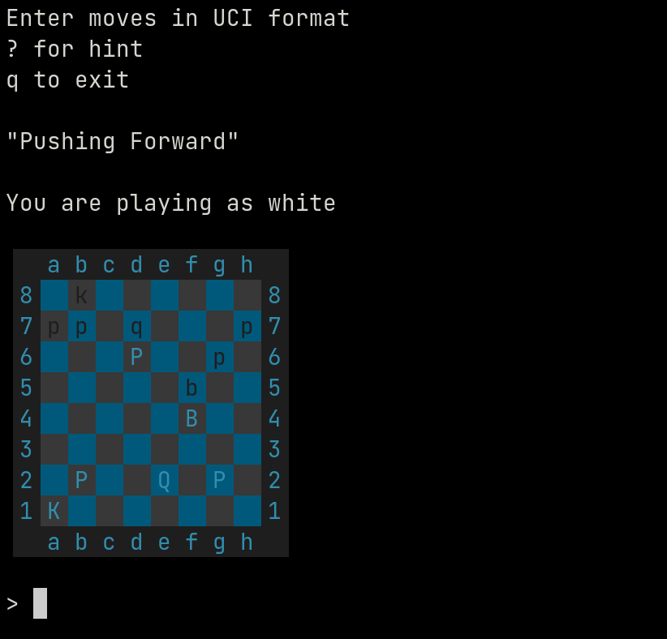

# Chess Puzzle

A CLI chess puzzle application that pulls data from the
[chess.com API](https://www.chess.com/news/view/published-data-api).



## Installing and Running

```
$ python3 -m virtualenv .venv
$ source .venv/bin/activate
$ pip3 install -r requirements.txt
$ python3 main.py
```
